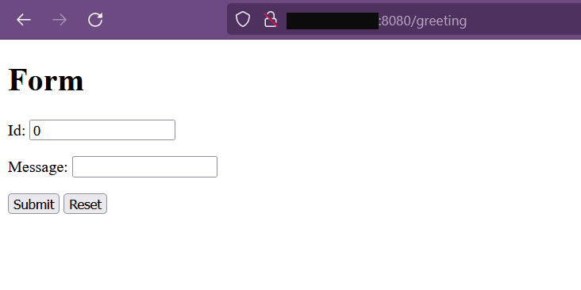
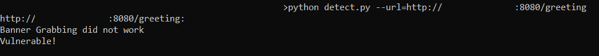
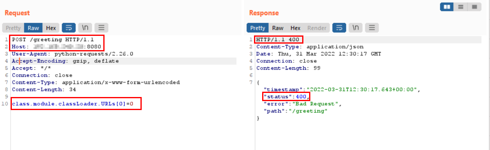

# Spring4Shell Detection Script
Scanner to detect the Spring4Shell vulnerability on input URLs

***Note:*** Detection Script has been tested on applications deployed using Apache Tomcat Server

## Prerequisite's
- python3
- python3 -m pip install -r requirements.txt

## Usage
python3 detect.py --help

```
usage: detect.py [-h] [--url TARGET] [--file TARGETS]

optional arguments:
  -h, --help   show this help message and exit
  --file FILE  File containing Form Endpoints
  --url URL    target Form Endpoint
```

## Example: 1
Run the script for single URL to detect Spring4Shell Vulnerability
```
python3 detect.py --url http://192.168.0.1/greeting
```

## Example: 2
Run the script for Multiple URLs by providing text file with ips to detect Spring4Shell Vulnerability
```
python3 detect.py --file ips.txt
```

## Sample Testing
We have a Sample Spring Application set up -


Running the script against it -
```
python3 detect.py --url http://192.168.0.1/greeting
```
Output -


Running via proxy to confirm -


## References
https://github.com/TheGejr/SpringShell/blob/master/exp.py
https://twitter.com/RandoriAttack/status/1509298490106593283

